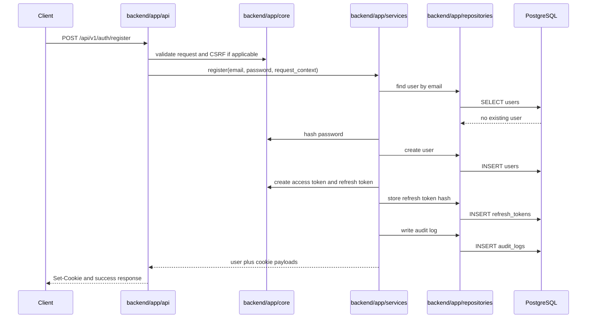
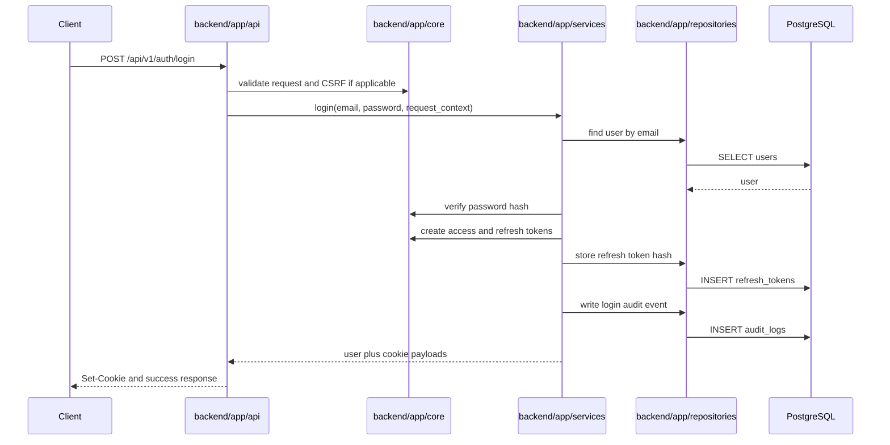
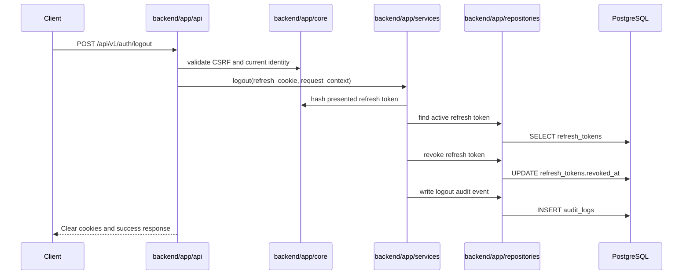
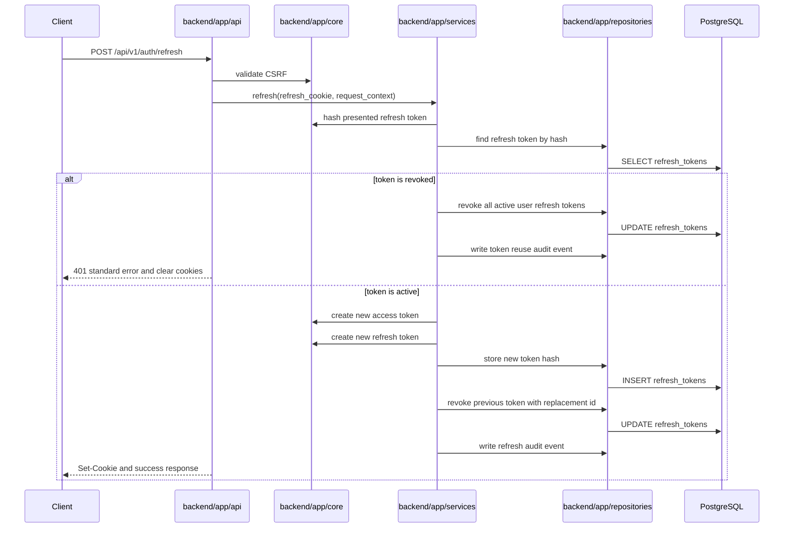
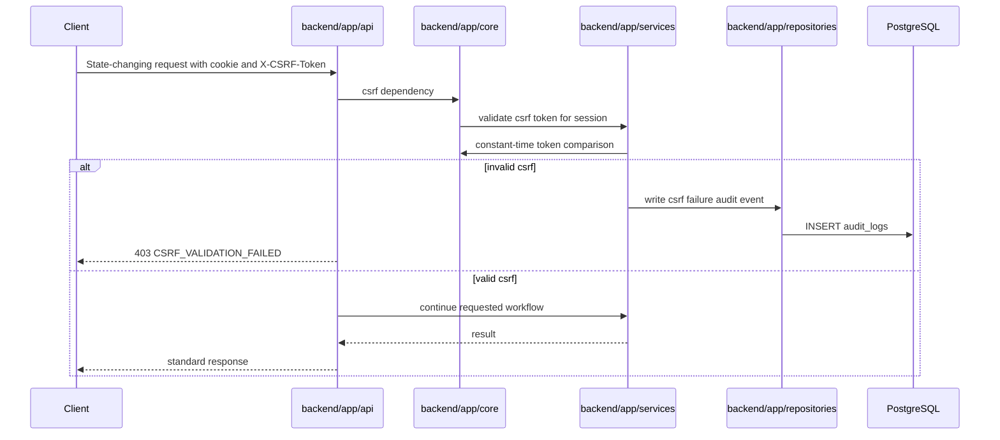
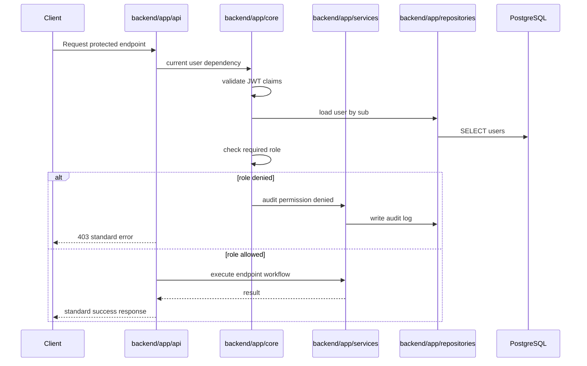
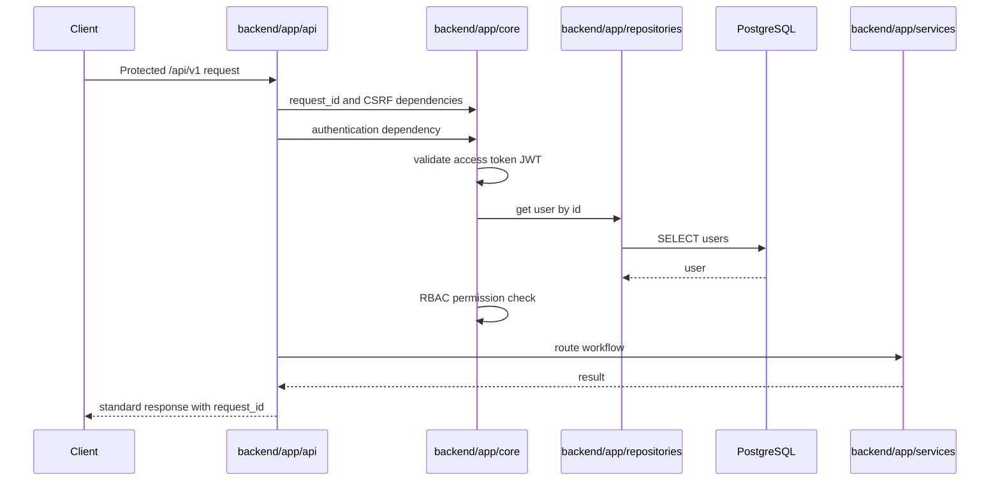

# Authentication Implementation Design

Project: Lead Generator App

Repository: lead-generator-app

Status: Phase 2 preparation only. This document defines implementation design and responsibilities. It does not implement authentication.

## 1. Purpose

This document describes the planned authentication architecture using the existing project specifications:

* `authentication-spec.md`
* `refresh-token-spec.md`
* `csrf-protection-spec.md`
* `api-spec.md`
* `api-error-contract.md`
* `security-standards.md`
* `data-model.md`

Authentication will use:

* HTTP-only secure cookies
* JWT access tokens
* opaque refresh tokens
* refresh token rotation
* CSRF token header validation
* role-based access control
* audit logging with `request_id`

Tokens must never be returned in JSON response bodies.

## 2. Module Responsibility Map

### backend/app/core/

Security primitives and request-level authentication helpers.

| Module | Responsibility |
| --- | --- |
| `auth.py` | JWT claim validation, current-user extraction contract, authentication dependency coordination |
| `security.py` | Password hashing and verification, token generation helpers, cookie settings, constant-time comparison helpers |
| `permissions.py` | RBAC permission checks and role validation |
| `dependencies.py` | FastAPI dependency factories for current user, required role, CSRF validation, request context |
| `exceptions.py` | Authentication, authorization, CSRF, token, and sanitized error exception types |

### backend/app/repositories/

Database access only. Repositories must not set cookies, validate requests, or format API responses.

| Repository | Responsibility |
| --- | --- |
| `UserRepository` | Lookup users by id and email, create users, update password hash or active state when needed |
| `RefreshTokenRepository` | Store token hashes, locate active token records, revoke current token, revoke all tokens for user, store rotated replacement token |
| `AuditLogRepository` | Persist security events with `user_id`, `request_id`, `ip_address`, `event_type`, and metadata |

### backend/app/services/

Application-level authentication workflows. Services coordinate repositories and core security helpers.

| Service | Responsibility |
| --- | --- |
| Auth service | Register, login, logout, logout-all, refresh, current-user lookup |
| Token service | Create JWT access tokens, create opaque refresh tokens, hash refresh tokens, rotate refresh tokens, detect token reuse |
| CSRF service | Generate CSRF tokens, bind tokens to session context, validate submitted CSRF header and cookie values |
| Audit service | Normalize and write authentication audit events |

### backend/app/api/

HTTP route layer. API modules validate request bodies, call services, set or clear cookies, and return standard response envelopes.

| API area | Responsibility |
| --- | --- |
| `/api/v1/auth/register` | Register user, set auth cookies, set CSRF cookie, return user data |
| `/api/v1/auth/login` | Verify credentials, set auth cookies, set CSRF cookie, return user data |
| `/api/v1/auth/refresh` | Rotate refresh token, set new auth cookies, refresh CSRF cookie |
| `/api/v1/auth/logout` | Revoke current refresh token, clear cookies |
| `/api/v1/auth/logout-all` | Revoke all user refresh tokens, clear cookies |
| `/api/v1/auth/me` | Return current authenticated user |
| `/api/v1/auth/csrf` | Set or refresh CSRF cookie |

## 3. Standard API Response Rules

Success responses:

```json
{
  "success": true,
  "data": {},
  "message": null,
  "request_id": "..."
}
```

Error responses:

```json
{
  "success": false,
  "error": {
    "code": "ERROR_CODE",
    "message": "Human-readable error message."
  },
  "request_id": "..."
}
```

Authentication responses must not include access tokens or refresh tokens in response bodies. Tokens are delivered only through cookies.

## 4. Registration Flow

Endpoint:

```text
POST /api/v1/auth/register
```

Flow:

1. API receives email and password.
2. Request body is validated with Pydantic.
3. CSRF validation is applied when cookies are accepted.
4. Auth service checks whether the email already exists.
5. Security helper validates password policy.
6. Security helper hashes the password with Argon2id.
7. User repository creates a user with role `user`.
8. Token service creates an access token and opaque refresh token.
9. Refresh token repository stores only the refresh token hash.
10. CSRF service creates a session-bound CSRF token.
11. Audit service writes registration or failure event.
12. API sets access token, refresh token, and CSRF cookies.
13. API returns standard success response with user data only.

Sequence:



## 5. Login Flow

Endpoint:

```text
POST /api/v1/auth/login
```

Flow:

1. API receives email and password.
2. Request body is validated with Pydantic.
3. CSRF validation is applied when cookies are accepted.
4. Auth service loads user by email.
5. Security helper verifies password hash.
6. Auth service rejects inactive users.
7. Token service creates access token and opaque refresh token.
8. Refresh token repository stores only the refresh token hash.
9. CSRF service creates a session-bound CSRF token.
10. Audit service writes login success or login failure.
11. API sets access token, refresh token, and CSRF cookies.
12. API returns standard success response with user data only.

Sequence:



## 6. Logout Flow

Endpoint:

```text
POST /api/v1/auth/logout
```

Flow:

1. API validates CSRF token for the state-changing request.
2. Auth dependency validates the access token when available.
3. Auth service reads the current refresh token cookie.
4. Token service hashes the presented refresh token.
5. Refresh token repository finds the matching active token.
6. Refresh token repository sets `revoked_at`.
7. Audit service writes logout event.
8. API clears access token, refresh token, and CSRF cookies.
9. API returns standard success response.

Sequence:



## 7. Refresh Token Rotation Flow

Endpoint:

```text
POST /api/v1/auth/refresh
```

Flow:

1. API validates CSRF token for the state-changing request.
2. Auth service reads the refresh token cookie.
3. Token service hashes the presented refresh token.
4. Refresh token repository loads the token record by hash.
5. Service rejects missing, expired, or revoked tokens.
6. If a revoked token is reused, service logs token reuse, revokes all active user sessions, and requires re-authentication.
7. Token service creates a new access token.
8. Token service creates a new opaque refresh token.
9. Refresh token repository stores the new refresh token hash.
10. Refresh token repository revokes the previous refresh token and stores `replaced_by_token_id`.
11. CSRF service refreshes the CSRF token.
12. Audit service writes token refresh event.
13. API sets new access token, refresh token, and CSRF cookies.
14. API returns standard success response with no token body.

Sequence:



## 8. Access Token Lifecycle

Access token type:

```text
JWT
```

Lifetime:

```text
15 minutes
```

Environment variable:

```text
AUTH_ACCESS_TOKEN_EXPIRE_MINUTES
```

Lifecycle:

1. Created after registration, login, or refresh.
2. Signed with `AUTH_JWT_SECRET_KEY`.
3. Delivered in an HTTP-only secure cookie.
4. Validated on protected endpoints.
5. Expires after the configured lifetime.
6. Replaced through refresh flow.
7. Cleared on logout and logout-all.

Access tokens are not stored in the database.

## 9. Refresh Token Lifecycle

Refresh token type:

```text
Opaque token
```

Lifetime:

```text
30 days
```

Environment variable:

```text
AUTH_REFRESH_TOKEN_EXPIRE_DAYS
```

Database table:

```text
refresh_tokens
```

Lifecycle:

1. Created after registration or login.
2. Delivered in an HTTP-only secure cookie.
3. Stored in database only as `token_hash`.
4. Validated during refresh and logout.
5. Rotated on every refresh operation.
6. Previous refresh token is revoked on successful rotation.
7. Reuse of a revoked token revokes all active user sessions.
8. Revoked or expired records are cleaned by the future `expired_refresh_token_cleanup` worker.

Raw refresh tokens must never be stored or logged.

## 10. Cookie Strategy

Authentication cookies:

| Cookie | Contains | HttpOnly | Secure | SameSite | Path |
| --- | --- | --- | --- | --- | --- |
| Access token cookie | JWT access token | true | true in production | Lax by default | `/` |
| Refresh token cookie | Opaque refresh token | true | true in production | Lax by default | `/` |
| CSRF cookie | CSRF token | false | true in production | Lax by default | `/` |

Cookie settings are controlled by:

```text
AUTH_COOKIE_DOMAIN
AUTH_COOKIE_SECURE
AUTH_COOKIE_SAMESITE
```

Storage rules:

* Do not store access tokens in `localStorage`.
* Do not store refresh tokens in `localStorage`.
* Do not store tokens in `sessionStorage`.
* Do not expose authentication tokens to browser-accessible JavaScript.
* Do not return authentication tokens in JSON response bodies.

## 11. CSRF Validation Flow

Pattern:

```text
CSRF Token Header pattern
```

State-changing methods:

```text
POST
PUT
PATCH
DELETE
```

Flow:

1. Backend issues a non-HTTP-only CSRF cookie.
2. Frontend reads the CSRF cookie.
3. Frontend sends the same value in `X-CSRF-Token`.
4. Backend reads the CSRF cookie.
5. Backend reads the `X-CSRF-Token` header.
6. Backend compares values using constant-time comparison.
7. Backend verifies the token is valid for the current session.
8. Backend rejects failures with HTTP `403` and `CSRF_VALIDATION_FAILED`.
9. Backend logs CSRF failures as security events.

Sequence:



## 12. JWT Claim Structure

Access token claims:

| Claim | Purpose |
| --- | --- |
| `sub` | User id as UUID string |
| `email` | User email for traceability and response context |
| `role` | User role: `admin`, `user`, or `system_worker` |
| `iat` | Issued-at timestamp |
| `exp` | Expiration timestamp |
| `jti` | Unique token id for traceability |
| `type` | Token type, expected value `access` |

Rules:

* `sub` is required for identity.
* `role` is required for RBAC.
* `exp` is required for expiration.
* `type` must prevent refresh tokens from being accepted as access tokens.
* Claims must not include secrets or raw refresh tokens.

## 13. RBAC Flow

Roles:

```text
admin
user
system_worker
```

Baseline permission model:

| Role | Intended access |
| --- | --- |
| `user` | Public V1 authenticated APIs such as search, view, and export |
| `admin` | Administrative and future controlled operations |
| `system_worker` | Internal `/internal/v1/*` worker APIs only |

Flow:

1. Protected endpoint declares required roles or permissions.
2. Dependency validates access token.
3. Dependency loads current user identity.
4. Permissions helper compares user role against required roles.
5. Request proceeds only if identity, role, and permission checks pass.
6. Denied access returns HTTP `403` with standard error contract.
7. Permission denial is logged as a security audit event.

Sequence:



## 14. Audit Logging Flow

Audit log table:

```text
audit_logs
```

Required fields:

* `user_id`
* `event_type`
* `ip_address`
* `request_id`
* `metadata`
* `created_at`

Events:

* registration success
* registration failure
* login success
* login failure
* logout
* logout-all
* token refresh
* token reuse attempt
* permission denied
* CSRF validation failure

Flow:

1. API or dependency captures request context.
2. Service normalizes event name and safe metadata.
3. Audit repository inserts audit log row.
4. Sensitive values are excluded from metadata.
5. Every event includes `request_id`.

## 15. Token Revocation Flow

Single-session revocation:

1. Hash presented refresh token.
2. Locate matching refresh token row.
3. Set `revoked_at`.
4. Clear auth cookies.
5. Write audit log.

All-device revocation:

1. Validate current user identity.
2. Locate all active refresh tokens for user.
3. Set `revoked_at` on all active records.
4. Clear current auth cookies.
5. Write `logout-all` audit log.

Reuse detection:

1. Hash presented refresh token.
2. Locate token row.
3. If row is already revoked, treat request as token reuse.
4. Revoke all active refresh tokens for the user.
5. Clear cookies.
6. Write token reuse audit event.
7. Return standard unauthorized response.

## 16. Protected Endpoint Flow

Applies to all protected public APIs under:

```text
/api/v1/*
```

Flow:

1. Request enters FastAPI route.
2. Request receives or propagates `request_id`.
3. CSRF dependency validates state-changing browser requests.
4. Authentication dependency reads access token cookie.
5. Core auth validates JWT signature, `exp`, `type`, `sub`, and `role`.
6. User repository verifies the user exists and is active.
7. Permissions dependency validates role or permission.
8. API route executes only after dependencies pass.
9. Response uses standard success wrapper.
10. Failures use standard error wrapper and include `request_id`.

Sequence:



## 17. Authentication Middleware and Dependency Architecture

Middleware responsibilities:

| Layer | Responsibility |
| --- | --- |
| Request ID middleware | Ensure each request has `request_id` |
| Logging middleware | Log request start and completion without secrets |
| Security headers middleware | Apply required security headers |
| CORS middleware | Allow only configured frontend origins |

Dependency responsibilities:

| Dependency | Responsibility |
| --- | --- |
| `get_request_context` | Provide `request_id`, IP address, user agent, and safe request metadata |
| `validate_csrf` | Validate CSRF cookie and `X-CSRF-Token` for state-changing browser requests |
| `get_current_user` | Validate access token cookie and load active user |
| `require_roles` | Enforce RBAC for route-specific roles |
| `get_optional_user` | Resolve identity for flows where user may or may not still have a valid access token |

Design rule:

* Middleware handles cross-cutting request concerns.
* Dependencies handle authentication and authorization gates.
* Services handle workflows.
* Repositories handle persistence.
* API routes handle HTTP request and response translation.

## 18. Error Mapping

| Condition | HTTP status | Error code |
| --- | --- | --- |
| Invalid credentials | `401` | `INVALID_CREDENTIALS` |
| Missing access token | `401` | `AUTHENTICATION_REQUIRED` |
| Invalid access token | `401` | `INVALID_ACCESS_TOKEN` |
| Expired access token | `401` | `ACCESS_TOKEN_EXPIRED` |
| Missing refresh token | `401` | `REFRESH_TOKEN_REQUIRED` |
| Expired refresh token | `401` | `REFRESH_TOKEN_EXPIRED` |
| Revoked refresh token reuse | `401` | `REFRESH_TOKEN_REUSE_DETECTED` |
| CSRF validation failure | `403` | `CSRF_VALIDATION_FAILED` |
| Permission denied | `403` | `PERMISSION_DENIED` |
| Duplicate registration email | `409` | `USER_ALREADY_EXISTS` |
| Request validation failure | `422` | `VALIDATION_ERROR` |

## 19. Phase 2 Implementation Boundaries

Phase 2 authentication implementation may create code inside:

```text
backend/app/core/
backend/app/services/
backend/app/repositories/
backend/app/api/
backend/app/schemas/
backend/tests/
```

Phase 2 must not:

* return access tokens in JSON response bodies
* return refresh tokens in JSON response bodies
* store raw refresh tokens
* store tokens in `localStorage`
* store tokens in `sessionStorage`
* expose PostgreSQL publicly
* introduce third-party authentication providers
* introduce Redis
* introduce Kubernetes
* change the approved API versioning
* implement future enrichment or scoring scope

## 20. Implementation Readiness Checklist

Before implementation begins, confirm:

* `backend/app/core/` placeholder modules exist.
* `users`, `refresh_tokens`, and `audit_logs` database tables exist.
* Environment validation covers authentication settings.
* Standard response and error wrapper utilities are available or planned.
* Tests will cover registration, login, refresh rotation, logout, logout-all, CSRF failure, RBAC denial, and audit logging.
* No authentication secrets are hardcoded.
