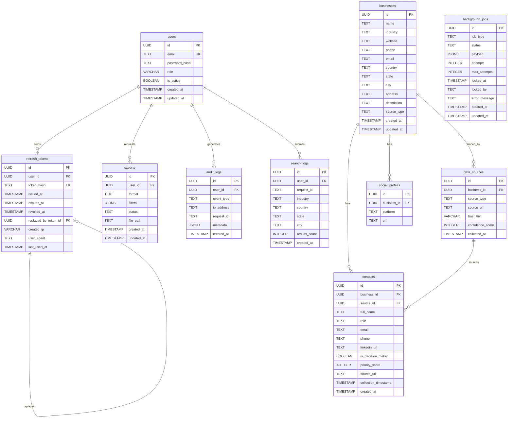

# Database ERD

Project: Lead Generator App

Repository: lead-generator-app

Scope: Phase 4A target database foundation.

Source of truth:

* `database/migrations/versions/20260624_0001_initial_core_schema.py`
* `database/migrations/versions/20260625_0002_scope_search_logs_to_users.py`
* Phase 4A required migration scope documented in `data-model.md`

Phase 4A implementation must add the documented contact traceability fields, foreign key, indexes, and uniqueness constraints before contact collection is enabled.

## Mermaid ERD

## Relationships

| From table | Column | To table | To column | Cardinality | Delete behavior |
| --- | --- | --- | --- | --- | --- |
| `refresh_tokens` | `user_id` | `users` | `id` | Many refresh tokens belong to one user | `ON DELETE CASCADE` |
| `refresh_tokens` | `replaced_by_token_id` | `refresh_tokens` | `id` | A refresh token may point to its replacement token | `ON DELETE SET NULL` |
| `contacts` | `business_id` | `businesses` | `id` | Many contacts belong to one business | `ON DELETE CASCADE` |
| `contacts` | `source_id` | `data_sources` | `id` | Many contacts may reference one data source | `ON DELETE RESTRICT` |
| `data_sources` | `business_id` | `businesses` | `id` | Many data sources belong to one business | `ON DELETE CASCADE` |
| `social_profiles` | `business_id` | `businesses` | `id` | Many social profiles belong to one business | `ON DELETE CASCADE` |
| `search_logs` | `user_id` | `users` | `id` | Many search logs belong to one user | `ON DELETE CASCADE` |
| `exports` | `user_id` | `users` | `id` | Many exports belong to one user | `ON DELETE CASCADE` |
| `audit_logs` | `user_id` | `users` | `id` | Many audit logs may belong to one user | `ON DELETE SET NULL` |

## Tables

### users

Stores application user records.

| Column | Type | Nullable | Key |
| --- | --- | --- | --- |
| `id` | UUID | No | Primary key |
| `email` | TEXT | No | Unique |
| `password_hash` | TEXT | No |  |
| `role` | VARCHAR(32) | No |  |
| `is_active` | BOOLEAN | No |  |
| `created_at` | TIMESTAMP WITH TIME ZONE | No |  |
| `updated_at` | TIMESTAMP WITH TIME ZONE | No |  |

Primary key:

| Constraint | Columns |
| --- | --- |
| `pk_users` | `id` |

Foreign keys: None.

Unique constraints:

| Constraint | Columns |
| --- | --- |
| `uq_users_email` | `email` |

Indexes:

| Index | Columns |
| --- | --- |
| `ix_users_email` | `email` |

Check constraints:

| Constraint | Rule |
| --- | --- |
| `ck_users_role_allowed` | `role IN ('admin', 'user', 'system_worker')` |

### refresh_tokens

Stores hashed opaque refresh tokens for token lifecycle tracking.

| Column | Type | Nullable | Key |
| --- | --- | --- | --- |
| `id` | UUID | No | Primary key |
| `user_id` | UUID | No | Foreign key |
| `token_hash` | TEXT | No | Unique |
| `issued_at` | TIMESTAMP WITH TIME ZONE | No |  |
| `expires_at` | TIMESTAMP WITH TIME ZONE | No |  |
| `revoked_at` | TIMESTAMP WITH TIME ZONE | Yes |  |
| `replaced_by_token_id` | UUID | Yes | Foreign key |
| `created_ip` | VARCHAR(45) | No |  |
| `user_agent` | TEXT | No |  |
| `last_used_at` | TIMESTAMP WITH TIME ZONE | No |  |

Primary key:

| Constraint | Columns |
| --- | --- |
| `pk_refresh_tokens` | `id` |

Foreign keys:

| Constraint | Columns | References | Delete behavior |
| --- | --- | --- | --- |
| `fk_refresh_tokens_user_id_users` | `user_id` | `users(id)` | `ON DELETE CASCADE` |
| `fk_refresh_tokens_replaced_by_token_id_refresh_tokens` | `replaced_by_token_id` | `refresh_tokens(id)` | `ON DELETE SET NULL` |

Unique constraints:

| Constraint | Columns |
| --- | --- |
| `uq_refresh_tokens_token_hash` | `token_hash` |

Indexes:

| Index | Columns |
| --- | --- |
| `ix_refresh_tokens_user_id` | `user_id` |
| `ix_refresh_tokens_token_hash` | `token_hash` |
| `ix_refresh_tokens_expires_at` | `expires_at` |
| `ix_refresh_tokens_revoked_at` | `revoked_at` |

### businesses

Stores business records discovered or entered by the application.

| Column | Type | Nullable | Key |
| --- | --- | --- | --- |
| `id` | UUID | No | Primary key |
| `name` | TEXT | No |  |
| `industry` | TEXT | No |  |
| `website` | TEXT | No |  |
| `phone` | TEXT | No |  |
| `email` | TEXT | Yes |  |
| `country` | TEXT | No |  |
| `state` | TEXT | No |  |
| `city` | TEXT | No |  |
| `address` | TEXT | No |  |
| `description` | TEXT | Yes |  |
| `source_type` | TEXT | No |  |
| `created_at` | TIMESTAMP WITH TIME ZONE | No |  |
| `updated_at` | TIMESTAMP WITH TIME ZONE | No |  |

Primary key:

| Constraint | Columns |
| --- | --- |
| `pk_businesses` | `id` |

Foreign keys: None.

Unique constraints: None.

Indexes:

| Index | Columns |
| --- | --- |
| `ix_businesses_country_state_city` | `country`, `state`, `city` |
| `ix_businesses_industry` | `industry` |
| `ix_businesses_name` | `name` |
| `ix_businesses_phone` | `phone` |
| `ix_businesses_website` | `website` |

### contacts

Stores public contact information associated with businesses.

| Column | Type | Nullable | Key |
| --- | --- | --- | --- |
| `id` | UUID | No | Primary key |
| `business_id` | UUID | No | Foreign key |
| `source_id` | UUID | No | Foreign key |
| `full_name` | TEXT | No |  |
| `role` | TEXT | Yes |  |
| `email` | TEXT | Yes |  |
| `phone` | TEXT | Yes |  |
| `linkedin_url` | TEXT | Yes |  |
| `is_decision_maker` | BOOLEAN | No |  |
| `priority_score` | INTEGER | No |  |
| `source_url` | TEXT | No |  |
| `collection_timestamp` | TIMESTAMP WITH TIME ZONE | No |  |
| `created_at` | TIMESTAMP WITH TIME ZONE | No |  |

Primary key:

| Constraint | Columns |
| --- | --- |
| `pk_contacts` | `id` |

Foreign keys:

| Constraint | Columns | References | Delete behavior |
| --- | --- | --- | --- |
| `fk_contacts_business_id_businesses` | `business_id` | `businesses(id)` | `ON DELETE CASCADE` |
| `fk_contacts_source_id_data_sources` | `source_id` | `data_sources(id)` | `ON DELETE RESTRICT` |

Unique constraints:

| Constraint | Columns | Rule |
| --- | --- | --- |
| `ux_contacts_business_source_email` | `business_id`, `source_id`, `lower(email)` | Partial unique index where `email IS NOT NULL` |
| `ux_contacts_business_source_phone` | `business_id`, `source_id`, `phone` | Partial unique index where `email IS NULL AND phone IS NOT NULL` |
| `ux_contacts_business_source_name_url` | `business_id`, `source_id`, `lower(full_name)`, `source_url` | Partial unique index where `email IS NULL AND phone IS NULL` |

Indexes:

| Index | Columns |
| --- | --- |
| `ix_contacts_business_id` | `business_id` |
| `ix_contacts_source_id` | `source_id` |
| `ix_contacts_collection_timestamp` | `collection_timestamp` |
| `ix_contacts_is_decision_maker` | `is_decision_maker` |
| `ix_contacts_role` | `role` |

Check constraints:

| Constraint | Rule |
| --- | --- |
| `ck_contacts_priority_score_range` | `priority_score >= 0 AND priority_score <= 100` |

### social_profiles

Stores normalized social profile URLs for businesses.

| Column | Type | Nullable | Key |
| --- | --- | --- | --- |
| `id` | UUID | No | Primary key |
| `business_id` | UUID | No | Foreign key |
| `platform` | TEXT | No |  |
| `url` | TEXT | No |  |

Primary key:

| Constraint | Columns |
| --- | --- |
| `pk_social_profiles` | `id` |

Foreign keys:

| Constraint | Columns | References | Delete behavior |
| --- | --- | --- | --- |
| `fk_social_profiles_business_id_businesses` | `business_id` | `businesses(id)` | `ON DELETE CASCADE` |

Unique constraints: None.

Indexes:

| Index | Columns |
| --- | --- |
| `ix_social_profiles_business_id` | `business_id` |

Check constraints:

| Constraint | Rule |
| --- | --- |
| `ck_social_profiles_platform_allowed` | `platform IN ('facebook', 'instagram', 'linkedin', 'youtube', 'x', 'website')` |

### data_sources

Tracks source provenance, trust tier, and confidence for business data.

| Column | Type | Nullable | Key |
| --- | --- | --- | --- |
| `id` | UUID | No | Primary key |
| `business_id` | UUID | No | Foreign key |
| `source_type` | TEXT | No |  |
| `source_url` | TEXT | No |  |
| `trust_tier` | VARCHAR(1) | No |  |
| `confidence_score` | INTEGER | No |  |
| `collected_at` | TIMESTAMP WITH TIME ZONE | No |  |

Primary key:

| Constraint | Columns |
| --- | --- |
| `pk_data_sources` | `id` |

Foreign keys:

| Constraint | Columns | References | Delete behavior |
| --- | --- | --- | --- |
| `fk_data_sources_business_id_businesses` | `business_id` | `businesses(id)` | `ON DELETE CASCADE` |

Unique constraints:

| Constraint | Columns | Rule |
| --- | --- | --- |
| `uq_data_sources_business_source_url` | `business_id`, `source_url` | Unique source URL per business |

Indexes:

| Index | Columns |
| --- | --- |
| `ix_data_sources_business_id` | `business_id` |

Check constraints:

| Constraint | Rule |
| --- | --- |
| `ck_data_sources_confidence_score_range` | `confidence_score >= 0 AND confidence_score <= 100` |
| `ck_data_sources_source_type_allowed` | `source_type IN ('website', 'directory', 'search_engine', 'manual')` |
| `ck_data_sources_trust_tier_allowed` | `trust_tier IN ('A', 'B', 'C', 'D')` |

### search_logs

Tracks search requests and result counts.

| Column | Type | Nullable | Key |
| --- | --- | --- | --- |
| `id` | UUID | No | Primary key |
| `user_id` | UUID | No | Foreign key to `users.id` |
| `request_id` | TEXT | No |  |
| `industry` | TEXT | No |  |
| `country` | TEXT | No |  |
| `state` | TEXT | No |  |
| `city` | TEXT | No |  |
| `results_count` | INTEGER | No |  |
| `created_at` | TIMESTAMP WITH TIME ZONE | No |  |

Primary key:

| Constraint | Columns |
| --- | --- |
| `pk_search_logs` | `id` |

Foreign keys:

| Constraint | Column | References | Delete behavior |
| --- | --- | --- | --- |
| `fk_search_logs_user_id_users` | `user_id` | `users(id)` | `ON DELETE CASCADE` |

Unique constraints: None.

Indexes: None.

### exports

Tracks export requests and generated file metadata.

| Column | Type | Nullable | Key |
| --- | --- | --- | --- |
| `id` | UUID | No | Primary key |
| `user_id` | UUID | No | Foreign key |
| `format` | TEXT | No |  |
| `filters` | JSONB | No |  |
| `status` | TEXT | No |  |
| `file_path` | TEXT | Yes |  |
| `created_at` | TIMESTAMP WITH TIME ZONE | No |  |
| `updated_at` | TIMESTAMP WITH TIME ZONE | No |  |

Primary key:

| Constraint | Columns |
| --- | --- |
| `pk_exports` | `id` |

Foreign keys:

| Constraint | Columns | References | Delete behavior |
| --- | --- | --- | --- |
| `fk_exports_user_id_users` | `user_id` | `users(id)` | `ON DELETE CASCADE` |

Unique constraints: None.

Indexes:

| Index | Columns |
| --- | --- |
| `ix_exports_user_id` | `user_id` |
| `ix_exports_status` | `status` |

Check constraints:

| Constraint | Rule |
| --- | --- |
| `ck_exports_format_allowed` | `format IN ('csv')` |
| `ck_exports_status_allowed` | `status IN ('pending', 'processing', 'completed', 'failed')` |

### background_jobs

Stores database-backed worker jobs.

| Column | Type | Nullable | Key |
| --- | --- | --- | --- |
| `id` | UUID | No | Primary key |
| `job_type` | TEXT | No |  |
| `status` | TEXT | No |  |
| `payload` | JSONB | No |  |
| `attempts` | INTEGER | No |  |
| `max_attempts` | INTEGER | No |  |
| `locked_at` | TIMESTAMP WITH TIME ZONE | Yes |  |
| `locked_by` | TEXT | Yes |  |
| `error_message` | TEXT | Yes |  |
| `created_at` | TIMESTAMP WITH TIME ZONE | No |  |
| `updated_at` | TIMESTAMP WITH TIME ZONE | No |  |

Primary key:

| Constraint | Columns |
| --- | --- |
| `pk_background_jobs` | `id` |

Foreign keys: None.

Unique constraints:

| Constraint | Columns | Rule |
| --- | --- | --- |
| `ux_background_jobs_active_idempotency` | `job_type`, `payload->>'idempotency_key'` | Partial unique index where `status IN ('pending', 'running')` |

Indexes:

| Index | Columns |
| --- | --- |
| `ix_background_jobs_job_type` | `job_type` |
| `ix_background_jobs_locked_at` | `locked_at` |
| `ix_background_jobs_status` | `status` |

Check constraints:

| Constraint | Rule |
| --- | --- |
| `ck_background_jobs_status_allowed` | `status IN ('pending', 'running', 'completed', 'failed')` |

### audit_logs

Stores security and user activity audit events.

| Column | Type | Nullable | Key |
| --- | --- | --- | --- |
| `id` | UUID | No | Primary key |
| `user_id` | UUID | Yes | Foreign key |
| `event_type` | TEXT | No |  |
| `ip_address` | TEXT | Yes |  |
| `request_id` | TEXT | No |  |
| `metadata` | JSONB | No |  |
| `created_at` | TIMESTAMP WITH TIME ZONE | No |  |

Primary key:

| Constraint | Columns |
| --- | --- |
| `pk_audit_logs` | `id` |

Foreign keys:

| Constraint | Columns | References | Delete behavior |
| --- | --- | --- | --- |
| `fk_audit_logs_user_id_users` | `user_id` | `users(id)` | `ON DELETE SET NULL` |

Unique constraints: None.

Indexes:

| Index | Columns |
| --- | --- |
| `ix_audit_logs_user_id` | `user_id` |
| `ix_audit_logs_request_id` | `request_id` |
| `ix_audit_logs_event_type` | `event_type` |

## Index Summary

| Table | Indexes |
| --- | --- |
| `users` | `ix_users_email` |
| `refresh_tokens` | `ix_refresh_tokens_user_id`, `ix_refresh_tokens_token_hash`, `ix_refresh_tokens_expires_at`, `ix_refresh_tokens_revoked_at` |
| `businesses` | `ix_businesses_country_state_city`, `ix_businesses_industry`, `ix_businesses_name`, `ix_businesses_phone`, `ix_businesses_website` |
| `contacts` | `ix_contacts_business_id`, `ix_contacts_source_id`, `ix_contacts_collection_timestamp`, `ix_contacts_is_decision_maker`, `ix_contacts_role`, `ux_contacts_business_source_email`, `ux_contacts_business_source_phone`, `ux_contacts_business_source_name_url` |
| `social_profiles` | `ix_social_profiles_business_id` |
| `data_sources` | `ix_data_sources_business_id`, `uq_data_sources_business_source_url` |
| `search_logs` | `ix_search_logs_user_id`, `ix_search_logs_request_id` |
| `exports` | `ix_exports_user_id`, `ix_exports_status` |
| `background_jobs` | `ix_background_jobs_job_type`, `ix_background_jobs_locked_at`, `ix_background_jobs_status`, `ux_background_jobs_active_idempotency` |
| `audit_logs` | `ix_audit_logs_user_id`, `ix_audit_logs_request_id`, `ix_audit_logs_event_type` |

## Unique Constraint Summary

| Table | Constraint | Columns |
| --- | --- | --- |
| `users` | `uq_users_email` | `email` |
| `refresh_tokens` | `uq_refresh_tokens_token_hash` | `token_hash` |
| `contacts` | `ux_contacts_business_source_email` | `business_id`, `source_id`, `lower(email)` where `email IS NOT NULL` |
| `contacts` | `ux_contacts_business_source_phone` | `business_id`, `source_id`, `phone` where `email IS NULL AND phone IS NOT NULL` |
| `contacts` | `ux_contacts_business_source_name_url` | `business_id`, `source_id`, `lower(full_name)`, `source_url` where `email IS NULL AND phone IS NULL` |
| `data_sources` | `uq_data_sources_business_source_url` | `business_id`, `source_url` |
| `background_jobs` | `ux_background_jobs_active_idempotency` | `job_type`, `payload->>'idempotency_key'` where `status IN ('pending', 'running')` |
