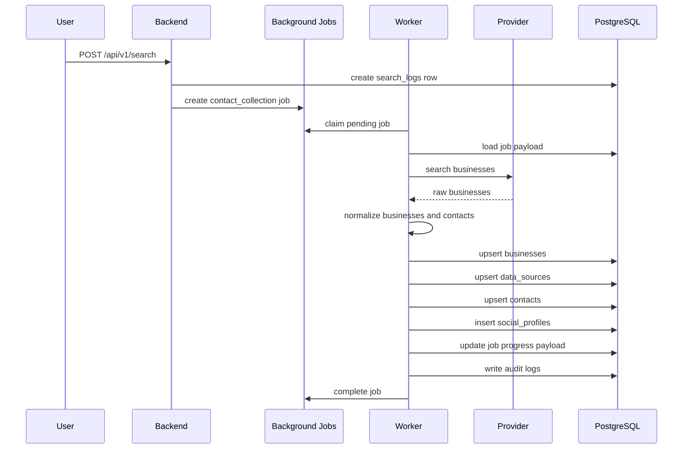

# Phase 4B Contact Collection Implementation Report

## Architecture

Phase 4B replaces the placeholder `contact_collection` worker handler with a
production contact collection pipeline while preserving the existing worker
polling, job claiming, retry, dead-letter, heartbeat, and internal API
infrastructure.

The search API now creates a `contact_collection` background job after a user
search is validated and logged. The worker continues to claim and complete jobs
through the existing internal APIs. The contact collection handler loads the
claimed job payload, validates it, runs a provider-backed business search,
normalizes and deduplicates businesses, records source traceability, extracts
public contact data, persists contacts and social profiles, updates job
progress, and emits audit events.

Provider implementations are isolated behind `BusinessSearchProvider` so Google
Maps, Yelp, Bing, OpenStreetMap, government directories, or custom providers can
be swapped in without changing the handler contract.

## Sequence Diagram



## Execution Flow

1. `SearchService.search()` writes the search log and creates a
   `contact_collection` job with a deterministic idempotency key.
2. The existing worker loop claims the job through the existing internal API.
3. `ContactCollectionHandler` validates the job payload and returns structured
   non-retryable failures for invalid payloads.
4. `ContactCollectionService` uses the configured provider chain. The current
   implementation supports payload-supplied businesses and OpenStreetMap
   Nominatim.
5. Businesses are normalized for whitespace, capitalization, URL casing, phone
   formatting, email casing, and deterministic identity.
6. Businesses are deduplicated by website, then phone, then name and location.
7. Each saved business receives a `data_sources` row and every contact records
   `business_id`, `source_id`, `source_url`, and `collection_timestamp`.
8. Contacts are deduplicated using the Phase 4A uniqueness rules: email, then
   phone, then full name plus source URL.
9. Social profiles are persisted for LinkedIn, Facebook, Instagram, YouTube, X,
   and Website.
10. Progress is persisted into the existing job payload and audit events are
    written for discovery, persistence, progress, and completion.

## Files Created

* `database/migrations/versions/20260626_0004_expand_social_profile_platforms.py`
* `docs/phase-4b-contact-collection-report.md`
* `worker/collectors/__init__.py`
* `worker/collectors/contact_collection.py`
* `worker/collectors/extraction.py`
* `worker/collectors/models.py`
* `worker/collectors/normalization.py`
* `worker/collectors/providers.py`
* `worker/collectors/repository.py`
* `worker/tests/test_contact_collection_domain.py`
* `worker/tests/test_contact_collection_handler.py`

## Files Modified

* `.env.example`
* `backend/app/models/social_profile.py`
* `backend/app/services/search_service.py`
* `backend/tests/test_migration_definition.py`
* `backend/tests/test_models_metadata.py`
* `backend/tests/test_search_service.py`
* `docker-compose.yml`
* `docs/data-model.md`
* `docs/database-erd.md`
* `worker/config/settings.py`
* `worker/jobs/executor.py`
* `worker/jobs/handlers.py`
* `worker/main.py`
* `worker/requirements.txt`

## Schema Alignment

Phase 4B requires X/Twitter and Website social profiles. The previous
`social_profiles.platform` check constraint allowed only Facebook, Instagram,
LinkedIn, and YouTube. Migration `20260626_0004` expands the allowed values to:

* `facebook`
* `instagram`
* `linkedin`
* `youtube`
* `x`
* `website`

No other database structure was changed.

## Validation Commands

Executed successfully:

```powershell
$env:PYTEST_DISABLE_PLUGIN_AUTOLOAD='1'; python -m pytest worker/tests/test_contact_collection_domain.py worker/tests/test_contact_collection_handler.py worker/tests/test_dispatcher.py worker/tests/test_executor.py worker/tests/test_retry_policy.py -q
$env:PYTEST_DISABLE_PLUGIN_AUTOLOAD='1'; python -m pytest backend/tests/test_migration_definition.py -q
python -m py_compile <touched backend, worker, and migration files>
```

Results:

* Focused Phase 4B validation command: `19 passed`
* Worker focused tests: `12 passed`
* Migration definition tests: `7 passed`
* Python compilation: passed

Attempted but blocked in this local session:

```powershell
docker version
docker compose build worker backend
$env:PYTEST_DISABLE_PLUGIN_AUTOLOAD='1'; python -m pytest backend/tests/test_search_service.py backend/tests/test_models_metadata.py -q
```

Docker validation could not run because the Docker daemon is not reachable from
this Windows session. Backend SQLAlchemy model/service tests could not run on
the host interpreter because it has an older SQLAlchemy version that does not
provide SQLAlchemy 2.x APIs such as `mapped_column`. The project containers pin
`SQLAlchemy==2.0.31`.

## Known Limitations

* The default live provider is OpenStreetMap Nominatim. Additional providers can
  be plugged in through the provider interface without changing the handler.
* The public-source fetcher only reads the business source URL and website URL;
  it does not implement a crawler engine or multi-page website traversal.
* Public HTML extraction is conservative and captures visible emails, phones,
  and supported social profile URLs. Deep person discovery, LinkedIn people
  lookup, enrichment, scoring, and AI analysis remain out of scope.
* Container-based integration validation must be rerun where Docker is
  available.

## Future Extension Points

* Add provider implementations for Google Maps, Yelp, Bing, government
  directories, and custom directory imports.
* Add source-specific parsers for known public directories.
* Add richer public website contact-page discovery in a future crawler phase.
* Add bulk database operations once provider result volumes increase.
