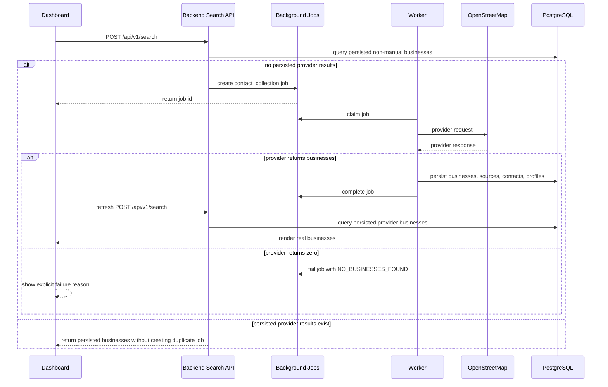

# Phase 5C Search Pipeline Remediation

## Root Cause

The `contact_collection` worker was completing jobs without calling the real
public provider path.

`CompositeBusinessProvider` executed `PayloadBusinessProvider` first.
`PayloadBusinessProvider` converted any payload containing `query` into a
business record. Backend-created search jobs always include `query`, so the
worker persisted a synthetic `manual` business derived from the search criteria
and never reached the OpenStreetMap provider.

This caused:

* jobs to show `Completed`
* dashboard refresh to work
* placeholder/manual rows to appear instead of real provider results
* zero-provider-result cases to be reported as generic success

## Pipeline Corrections

Implemented:

* payload provider now only returns businesses when explicit
  `payload.data.businesses` records exist
* normal frontend search jobs fall through to the OpenStreetMap provider
* OpenStreetMap provider logs provider request, HTTP status, and result count
* invalid provider responses raise `INVALID_PROVIDER_RESPONSE`
* rate limiting raises `HTTP_429`
* provider timeout/DNS/server errors remain retryable
* zero provider results raise `NO_BUSINESSES_FOUND`
* zero result jobs no longer complete as generic success
* worker progress records failure reason
* business persistence logs inserted versus updated records
* production search results exclude legacy `manual` rows so stale placeholder
  records do not block real collection
* provider-collected businesses preserve selected country/state/city for search
  indexing while retaining the provider address for display

## End-to-End Flow



## Structured Logging

Added or surfaced log events for:

* `search_request_received`
* `search_refresh_query`
* `background_job_created`
* `background_job_skipped`
* `dashboard_search_response_ready`
* `contact_collection_payload_loaded`
* `contact_collection_started`
* `provider_selected`
* `provider_request`
* `provider_response`
* `provider_response_failed`
* `provider_result`
* `contact_collection_provider_results`
* `business_persisted`
* `contact_collection_failed`
* `contact_collection_completed`

Both backend and worker JSON formatters now include structured `extra` fields.

## Validation Commands

Executed locally:

```bash
python -m py_compile backend/app/repositories/business_repository.py backend/app/services/search_service.py backend/app/services/logging.py worker/collectors/providers.py worker/collectors/contact_collection.py worker/config/logging.py

$env:PYTEST_DISABLE_PLUGIN_AUTOLOAD='1'; python -m pytest worker/tests/test_contact_collection_domain.py worker/tests/test_contact_collection_handler.py worker/tests/test_dispatcher.py worker/tests/test_executor.py worker/tests/test_retry_policy.py -q

cd frontend
vitest run src/features/search/SearchWorkspace.test.tsx src/features/search/ResultsTable.test.tsx src/features/search/SearchForm.test.tsx
```

## AWS Validation

```bash
git pull origin master
git checkout v0.5.3

docker compose build backend worker frontend
docker compose up -d
docker compose ps
```

Validate database persistence:

```bash
docker compose exec postgres psql -U "$POSTGRES_USER" -d "$POSTGRES_DB" -c \
"SELECT id, name, industry, phone, email, website, address, source_type, created_at FROM businesses ORDER BY created_at DESC LIMIT 20;"
```

Validate no placeholder/manual rows are driving dashboard search:

```bash
docker compose exec postgres psql -U "$POSTGRES_USER" -d "$POSTGRES_DB" -c \
"SELECT source_type, count(*) FROM businesses GROUP BY source_type ORDER BY source_type;"
```

Validate job failure reasons:

```bash
docker compose exec postgres psql -U "$POSTGRES_USER" -d "$POSTGRES_DB" -c \
"SELECT status, error_message, payload->'progress' AS progress FROM background_jobs ORDER BY created_at DESC LIMIT 10;"
```

Browser validation:

1. Sign in.
2. Submit a search for a supported country/state/city.
3. Confirm a `contact_collection` job is created.
4. Watch worker logs for `provider_request` and `provider_response`.
5. Confirm the job completes only when businesses are returned and persisted.
6. Confirm the dashboard table shows persisted provider rows with non-`manual`
   source values.
7. If provider returns zero rows, confirm the dashboard shows the explicit job
   failure reason instead of generic completion.
